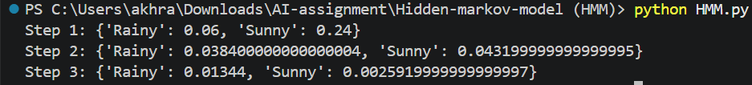
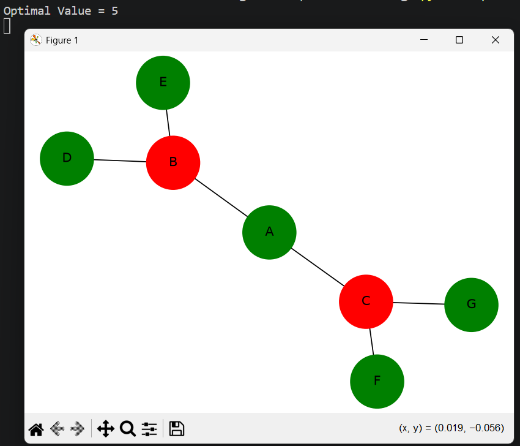
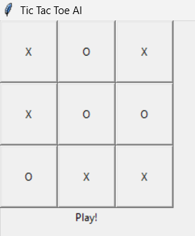

# Artificial Intelligence Assignment

## Student Details

** Name: Guthal Basumatary
** Roll No: 220710007026

# Assignment Overview

This repository contains implementations of three fundamental Artificial Intelligence algorithms and techniques:

1. Hidden Markov Model (HMM)
2. Alpha-Beta Pruning Tree Visualization
3. Tic-Tac-Toe using Minimax Algorithm

# 1. Hidden Markov Model (HMM)

## Description

A Hidden Markov Model (HMM) is a statistical model used to represent systems where the states are hidden but observations are visible. This project implements the Viterbi Algorithm to determine the most likely sequence of hidden states based on a sequence of observations.

## Features

- State probability calculation
- Observation processing
- Viterbi Algorithm implementation
- Most likely hidden state prediction

## Tools and Libraries Used

- Python
- NumPy

## File
HMM.py

## HMM Output

# 2. Alpha-Beta Pruning Tree Visualization

## Description

Alpha-Beta Pruning is an optimization technique used in the Minimax algorithm. It reduces the number of nodes evaluated in a game tree by eliminating branches that cannot influence the final decision.

This project calculates the optimal value and visualizes the game tree using graph representation.

## Features

- Alpha-Beta Pruning implementation
- Optimal value calculation
- Tree visualization
- Pruned node representation

## Tools and Libraries Used

- Python
- NetworkX
- Matplotlib

## File
alpha-beta.py

## Alpha-Beta Pruning Output

# 3. Tic-Tac-Toe using Minimax Algorithm

## Description

This project implements a Tic-Tac-Toe game where the player competes against an AI opponent. The AI uses the Minimax Algorithm to determine the best possible move, making it extremely difficult to defeat.

## Features

- Human vs AI gameplay
- Minimax Algorithm
- Graphical User Interface (GUI)
- Intelligent move selection

## Tools and Libraries Used

- Python
- Tkinter

## File
tic-tac-toe.py

## Tic-Tac-Toe Output

# Conclusion

This assignment demonstrates the implementation of important Artificial Intelligence concepts including probabilistic reasoning using Hidden Markov Models, game tree optimization using Alpha-Beta Pruning, and decision-making using the Minimax Algorithm.
